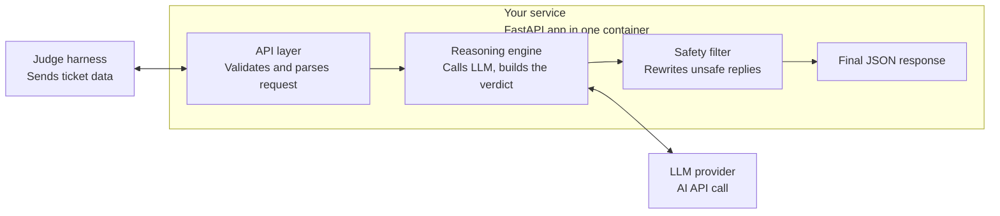

# QueueStorm FastAPI

QueueStorm FastAPI is a lightweight ticket-analysis service built with **FastAPI**.  
It accepts a customer ticket plus transaction history, sends the request through the reasoning engine, and returns a structured verdict with a safety-checked reply.

## Architecture

This service runs as a single FastAPI app inside one container:



### Request flow

1. **API layer** receives the JSON payload and validates it with Pydantic models.
2. **Reasoning engine** reads the complaint and transaction history, then produces the case verdict.
3. **LLM provider** is called for the natural-language parts of the response.
4. **Safety filter** rewrites unsafe replies before the response is returned.
5. The service returns a strict JSON object that matches the expected schema.

## Project structure

```text
QueueStorm_FastApi/
app/
  main.py
  schemas.py
  safety_filter.py
requirements.txt
vercel.json
```

## Features

- Fast request validation with `FastAPI` and `Pydantic`
- Structured ticket analysis response
- Safety filter for credential, refund, and unofficial-contact risks
- Environment-based configuration with `.env`
- Simple deployment path for container or serverless hosting

## Requirements

- Python 3.10+
- `pip`
- One LLM API key or backend configured by the app

## Environment variables

Create a `.env` file in `QueueStorm_FastApi/`:

```bash
GROQ_API_KEY=your_api_key_here
GROQ_MODEL=openai/gpt-oss-20b
```

If your app uses additional provider keys later, add them here too.

## Local setup

```bash
cd QueueStorm_FastApi
python -m venv .venv
.venv\Scripts\activate
pip install -r requirements.txt
```

## Run locally

```bash
uvicorn app.main:app --reload
```

The service will usually be available at:

- `http://127.0.0.1:8000`
- `http://127.0.0.1:8000/docs`

## API

### `GET /`

Basic app entrypoint, if exposed by your deployment.

### `POST /analyze-ticket`

Send a ticket payload with complaint text and transaction history.

Example:

```json
{
  "ticket_id": "TKT-001",
  "complaint": "I sent money to the wrong number.",
  "language": "en",
  "channel": "in_app_chat",
  "user_type": "customer",
  "transaction_history": [
    {
      "transaction_id": "TXN-9101",
      "timestamp": "2026-04-14T14:08:22Z",
      "type": "transfer",
      "amount": 5000,
      "counterparty": "+8801719876543",
      "status": "completed"
    }
  ]
}
```

## Deployment options

### Vercel

This repo already includes `vercel.json`, so Vercel is the fastest option if you want a simple serverless deployment.

### Render / Railway / Fly.io

These are good choices if you want the app to run as a normal web service or inside a container.

### Docker

If you prefer containers, add a `Dockerfile` in this folder and deploy the image anywhere that supports Python containers.

## Safety behavior

The app includes a reply sanitizer that:

- blocks requests for PIN, OTP, password, and card details
- rewrites direct refund promises into safer wording
- avoids unofficial or third-party contact instructions

## Notes

- Keep the complaint and transaction history in the request body.
- Return only schema-compliant JSON from the analysis endpoint.
- Use the `/docs` page during development to inspect request/response shapes quickly.
