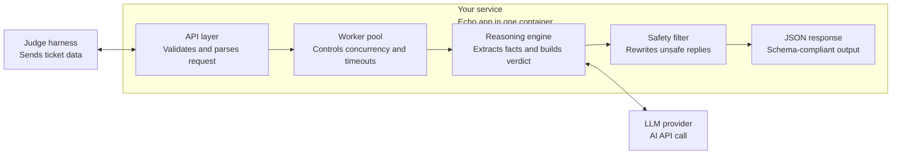

# QueueStorm Investigator

QueueStorm Investigator is a fast, concurrency-safe support copilot built in **Go** with the **Echo** web framework.
It analyzes customer complaints alongside transaction history, determines the most relevant facts, routes the case to the right team, and returns a safe, structured response in English or Bangla.

## Architecture



### Request flow

1. The **judge harness** sends ticket data to the service.
2. The **API layer** validates the request and rejects malformed input early.
3. The **worker pool** keeps concurrency under control and applies request timeouts.
4. The **reasoning engine** resolves the case facts and prepares the verdict.
5. The **LLM provider** generates the natural-language fields when needed.
6. The **safety filter** rewrites unsafe output before the final JSON response is returned.

## Key capabilities

- Strict request validation with Echo
- Deterministic fact extraction for transaction matching
- Multi-provider LLM failover for response generation
- Safety guardrails for PIN, OTP, password, refund, and unofficial-contact content
- Schema-compliant JSON responses for automated evaluation

## Project layout

```text
queuestorm-echo/
cmd/
internal/
Dockerfile
air.toml
go.mod
```

## Requirements

- Go 1.21+ recommended
- One or more LLM API keys configured in the environment

## Environment variables

Create a `.env` file or export these values before running the server:

```bash
GEMINI_API_KEY=your_primary_key
GEMINI_API_KEY_BACKUP=your_backup_key_optional
GROQ_API_KEY=your_groq_key
PORT=8080
MAX_WORKERS=10
```

## Run locally

### Option 1: Run directly with Go

```bash
go run cmd/server/main.go
```

### Option 2: Run with live reload

```bash
air
```

### Run the sample test runner

```bash
go run cmd/test_runner/main.go
```

## API

### `GET /health`

Returns a simple health check:

```json
{ "status": "ok" }
```

### `POST /analyze-ticket`

Send a complaint and transaction history to receive a structured analysis response.

Example request:

```json
{
  "ticket_id": "TKT-001",
  "complaint": "I sent 5000 taka to a wrong number around 2pm today.",
  "language": "en",
  "channel": "in_app_chat",
  "user_type": "customer",
  "transaction_history": [
    {
      "transaction_id": "TXN-9101",
      "timestamp": "2026-04-14T14:08:22Z",
      "type": "transfer",
      "amount": 5000,
      "counterparty": "+8801719876543",
      "status": "completed"
    }
  ]
}
```

## Deployment options

- **Docker**: best for portable deployment
- **Render**: quick GitHub-connected deploy
- **Railway**: fast setup with simple environment variables
- **Fly.io**: good for small container-based services

## Safety rules

The response sanitizer is designed to:

- block requests for PIN, OTP, password, and card details
- avoid promising direct refunds or reversals
- keep customers on official support channels
- rewrite risky reply text before it reaches the user

## Notes

- The service is designed to return valid JSON only.
- Keep the complaint and transaction history in the same request.
- For production, store secrets in environment variables rather than committing them.
