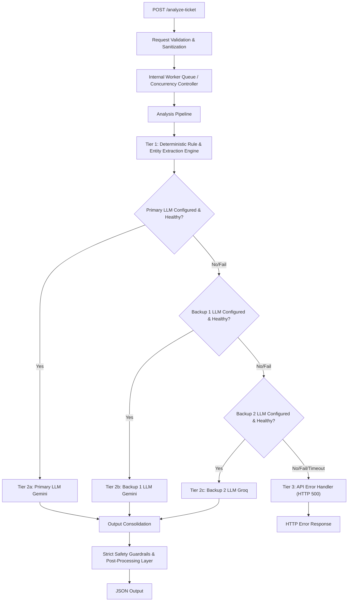

# QueueStorm Investigator

QueueStorm Investigator is a fast, concurrency-safe support copilot built in **Go** with the **Echo** web framework.
It analyzes customer complaints alongside transaction history, determines the most relevant facts, routes the case to the right team, and returns a safe, structured response in English or Bangla.

## Architecture



### Request flow

1. `POST /analyze-ticket` receives the ticket payload.
2. The **request validation** layer sanitizes and checks the input.
3. The **internal worker queue** controls concurrency and request timeouts.
4. **Tier 1** extracts entities and deterministic facts from the complaint and transaction history.
5. **Tier 2** tries Gemini first, then Gemini backup, then Groq as the final model tier.
6. If all model tiers fail, the service returns an **HTTP 500** error.
7. The **safety layer** rewrites risky output before the final JSON response is returned.

### Tier breakdown

- **Tier 1 — Deterministic Go engine:** extracts amounts, transaction IDs, entity matches, and evidence signals without an API call.
- **Tier 2a — Gemini primary:** generates the first-pass natural-language output.
- **Tier 2b — Gemini backup:** handles fallback generation if the primary model is unavailable.
- **Tier 2c — Groq backup:** final model fallback before returning an API error.
- **Safety layer:** rewrites risky content before returning the JSON response.

## Key capabilities

- Strict request validation with Echo
- Deterministic fact extraction for transaction matching
- Multi-provider LLM failover for response generation
- Safety guardrails for PIN, OTP, password, refund, and unofficial-contact content
- Schema-compliant JSON responses for automated evaluation

## Project layout

```text
queuestorm-echo/
cmd/
internal/
Dockerfile
air.toml
go.mod
```

## Requirements

- Go 1.21+ recommended
- One or more LLM API keys configured in the environment

## Environment variables

Create a `.env` file or export these values before running the server:

```bash
GEMINI_API_KEY=your_primary_key
GEMINI_API_KEY_BACKUP=your_backup_key_optional
GROQ_API_KEY=your_groq_key
PORT=8080
MAX_WORKERS=10
```

## Run locally

### Option 1: Run directly with Go

```bash
go run cmd/server/main.go
```

### Option 2: Run with live reload

```bash
air
```

### Run the sample test runner

```bash
go run cmd/test_runner/main.go
```

## API

### `GET /health`

Returns a simple health check:

```json
{ "status": "ok" }
```

### `POST /analyze-ticket`

Send a complaint and transaction history to receive a structured analysis response.

Example request:

```json
{
  "ticket_id": "TKT-001",
  "complaint": "I sent 5000 taka to a wrong number around 2pm today.",
  "language": "en",
  "channel": "in_app_chat",
  "user_type": "customer",
  "transaction_history": [
    {
      "transaction_id": "TXN-9101",
      "timestamp": "2026-04-14T14:08:22Z",
      "type": "transfer",
      "amount": 5000,
      "counterparty": "+8801719876543",
      "status": "completed"
    }
  ]
}
```
